# ATC Support Platform — Standard Operating Procedures (SOPs)

## Table of Contents
1. [SOP-001: User Login and Session Management](#sop-001-user-login-and-session-management)
2. [SOP-002: Creating and Configuring a New Client](#sop-002-creating-and-configuring-a-new-client)
3. [SOP-003: Adding Consignees and Contacts to a Client](#sop-003-adding-consignees-and-contacts-to-a-client)
4. [SOP-004: Creating a New Project and Generating a Widget Key](#sop-004-creating-a-new-project-and-generating-a-widget-key)
5. [SOP-005: Configuring Julia AI](#sop-005-configuring-julia-ai)
6. [SOP-006: Managing FAQs and Project Docs](#sop-006-managing-faqs-and-project-docs)
7. [SOP-007: Hardware Asset Management](#sop-007-hardware-asset-management)
8. [SOP-008: Annual Maintenance Contract (AMC) Management](#sop-008-annual-maintenance-contract-amc-management)
9. [SOP-009: Widget Embed Flow](#sop-009-widget-embed-flow)
10. [SOP-010: Julia AI Escalation to Ticket](#sop-010-julia-ai-escalation-to-ticket)
11. [SOP-011: Support Ticket Triage and Queue Management](#sop-011-support-ticket-triage-and-queue-management)
12. [SOP-012: Ticket Escalation](#sop-012-ticket-escalation)
13. [SOP-013: Replying to and Resolving a Ticket](#sop-013-replying-to-and-resolving-a-ticket)
14. [SOP-014: Email Thread Handling](#sop-014-email-thread-handling)
15. [SOP-015: Notification Management](#sop-015-notification-management)
16. [SOP-016: Reports and Dashboard Usage](#sop-016-reports-and-dashboard-usage)
17. [SOP-017: User and Role Management](#sop-017-user-and-role-management)

---

## SOP-001: User Login and Session Management

### 1. Purpose
To guide internal team members (PMs and SEs) on securely accessing the ATC Support operations console.

### 2. Scope
Project Managers (PM) and Support Engineers (SE).

### 3. Prerequisites
- An active user account with credentials provided by an administrator.
- Network access to the ATC Support domain.

### 4. Step-by-step Procedure
1. Navigate to the agent login URL in your web browser.
2. Enter your registered email address and password into the login form.
   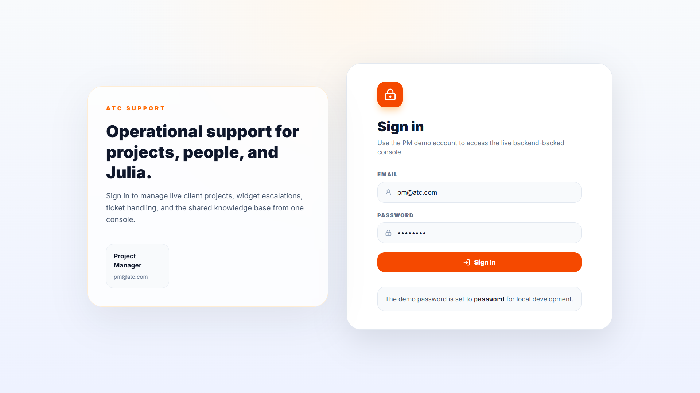
3. Click the **Log In** button.
4. Upon successful authentication, you will be redirected to your default Dashboard containing queue statistics.
   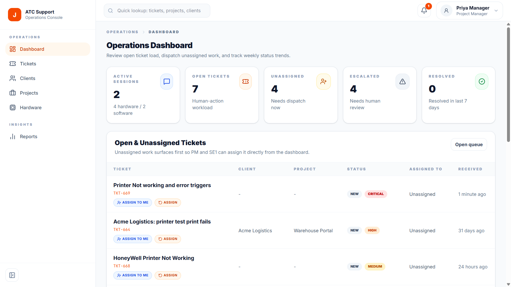

### 5. Expected Outcome
The user is successfully authenticated, receives role-based access, and the Dashboard loads with relevant data.

### 6. Troubleshooting / Edge Cases
- **Invalid Credentials:** Ensure the correct email and password. Reset the password if needed via an administrator.
- **Session Expiration:** The system auto-refreshes tokens. If the refresh token expires, you will be logged out and must sign in again.

### 7. Related SOPs
- SOP-017: User and Role Management

---

## SOP-002: Creating and Configuring a New Client

### 1. Purpose
To register a new customer organization in the system, forming the foundation for project tracking and hardware management.

### 2. Scope
Project Managers (PM).

### 3. Prerequisites
- PM access level.
- Core details of the client (Name, Industry, Address, Primary Email).

### 4. Step-by-step Procedure
1. From the sidebar navigation, click on **Clients** to view the master list.
   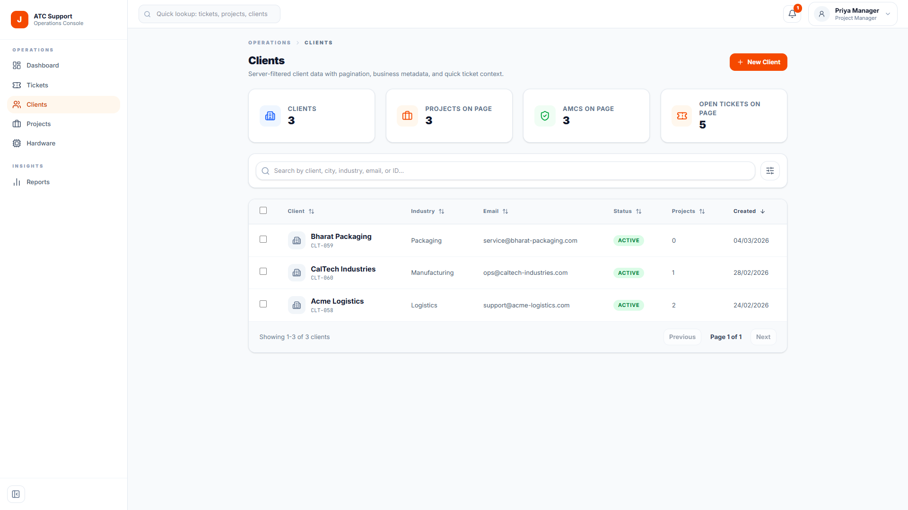
2. Click the **+ New Client** button in the upper right corner.
3. Fill in the organization details in the Client Overview/Summary tab. Provide Company Name, Industry, Address, Phone, and Email.
   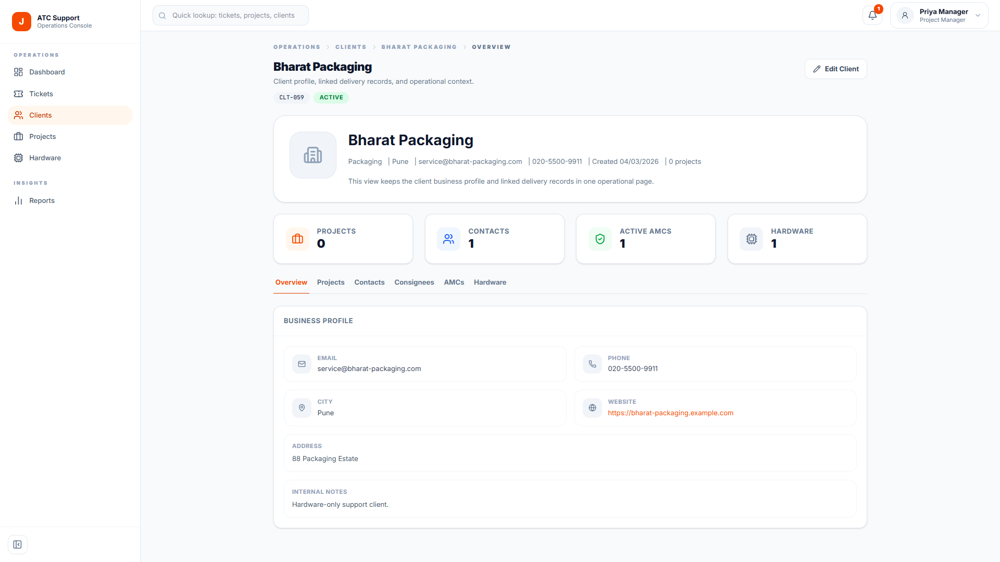
4. Click **Save** to create the client record.

### 5. Expected Outcome
A new Client entity is instantiated with a status of ACTIVE, unlocking sub-tabs for Contacts, Projects, AMCs, and Hardware.

### 6. Troubleshooting / Edge Cases
> ⚠️ **Warning:** Ensure the client name is spelled correctly as it feeds into reports and widget metadata.

### 7. Related SOPs
- SOP-003: Adding Consignees and Contacts to a Client
- SOP-004: Creating a New Project and Generating a Widget Key

---

## SOP-003: Adding Consignees and Contacts to a Client

### 1. Purpose
To record individual contact persons and physical delivery/shipping locations (Consignees) for an existing Client.

### 2. Scope
Project Managers (PM).

### 3. Prerequisites
- PM access level.
- An existing, active Client record.

### 4. Step-by-step Procedure
1. Navigate to the **Clients** list and select the target client.
2. Switch to the **Contacts** tab along the top navigation of the client's profile.
   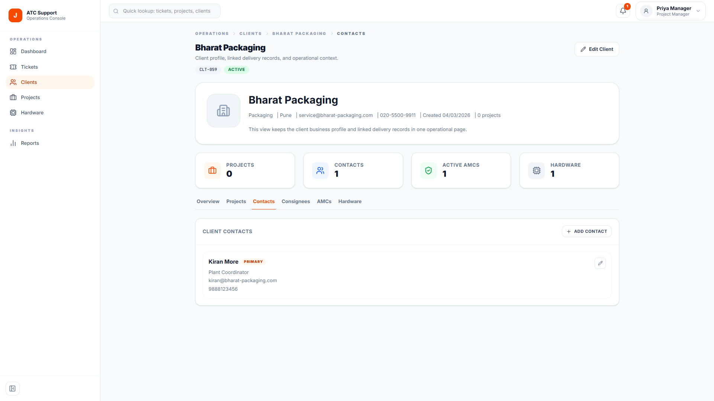
3. Click **Add Contact** to insert a primary point of contact for the client entity.
4. To add location-based contacts, switch to the **Consignees** section (if separate) or add them under the respective location record.
5. Save your changes.

### 5. Expected Outcome
Contact information is tied to the client profile, enabling agents to select valid requesters during internal ticket creation.

### 6. Troubleshooting / Edge Cases
- **Duplicate emails:** Contact emails should ideally be unique to avoid thread matching collisions.

### 7. Related SOPs
- SOP-002: Creating and Configuring a New Client

---

## SOP-004: Creating a New Project and Generating a Widget Key

### 1. Purpose
To isolate support workflows, configure the Julia AI widget, and define knowledge base boundaries for a specific client initiative.

### 2. Scope
Project Managers (PM).

### 3. Prerequisites
- PM access level.
- An existing Client record.

### 4. Step-by-step Procedure
1. Open the target client's profile and navigate to the **Projects** tab.
   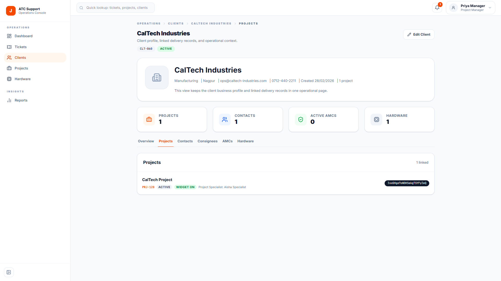
2. Click **+ New Project**. 
   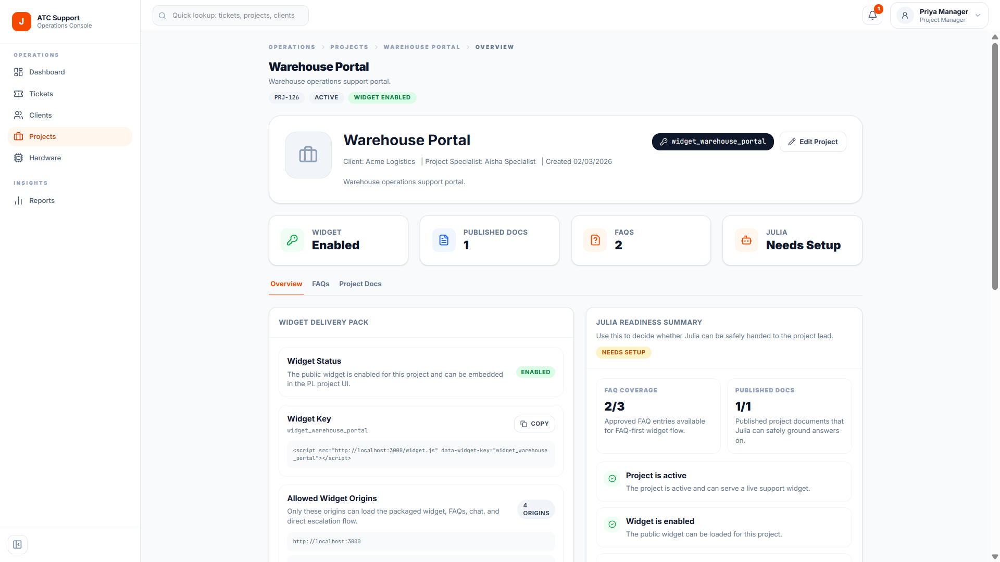
3. Define the Project Name, Description, and set the unique **Widget Key** (e.g., `widget_clientname_project`).
   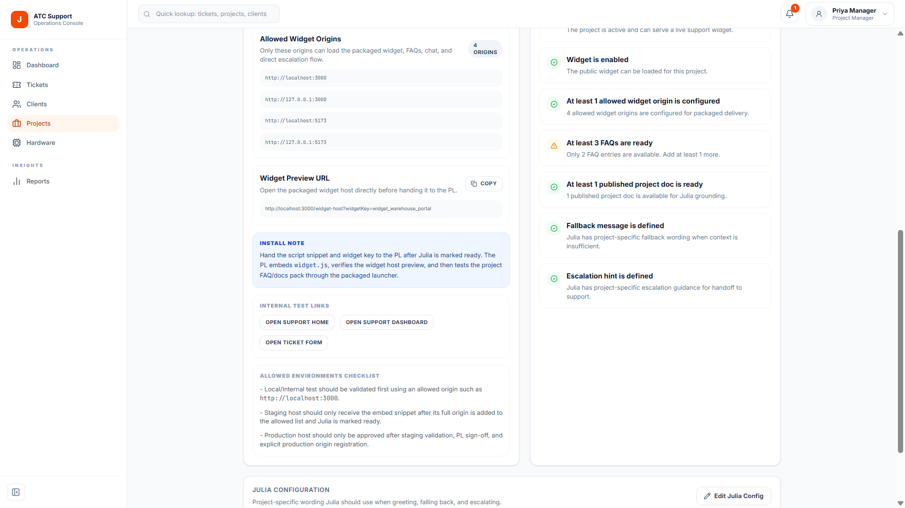
4. Assign a Support Engineer to act as the Project Lead.
5. Save the project to activate it.

### 5. Expected Outcome
The project is created with a unique `widgetKey` ready to be embedded on the client's site, and SEs are assigned.

### 6. Troubleshooting / Edge Cases
- **Widget Key Format:** Do not include spaces or special characters in the Widget Key. Use underscores or hyphens.

### 7. Related SOPs
- SOP-005: Configuring Julia AI
- SOP-009: Widget Embed Flow

---

## SOP-005: Configuring Julia AI

### 1. Purpose
To customize the behavior, greeting, and safety fallbacks of the Julia LLM agent for a designated Project.

### 2. Scope
Project Managers (PM).

### 3. Prerequisites
- An active project.
- A valid GROQ API key defined in backend `.env`.

### 4. Step-by-step Procedure
1. Open the target Project profile.
2. Navigate to the **Julia Settings / Widget Configuration** section or tab.
   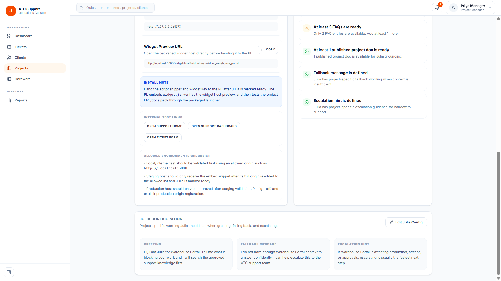
3. Enter the **Julia Greeting** (e.g., "Hi! I'm Julia, ATC's support assistant for this product").
4. Enter the **Fallback Message** (what Julia says if it doesn't know the answer).
5. Enter the **Escalation Hint** (instructions appended when Julia cannot resolve the issue).
6. Under **Widget Allowed Domains**, list the URLs where the widget is permitted to be hosted.
7. Toggle the "Enable Julia Widget" switch.
8. Save settings.

### 5. Expected Outcome
Julia AI operates according to the localized project guidelines and rejects requests originating from unlisted domains.

### 6. Troubleshooting / Edge Cases
> 💡 **Tip:** Julia requires at least one "Published" Project Doc to be fully operational. Without context, it will quickly resort to the fallback message.

### 7. Related SOPs
- SOP-006: Managing FAQs and Project Docs

---

## SOP-006: Managing FAQs and Project Docs

### 1. Purpose
To populate the knowledge base that feeds both the static end-user support portal and Julia's Retrieval-Augmented Generation (RAG) context.

### 2. Scope
Project Managers (PM), Support Engineers (SE - depending on permissions).

### 3. Prerequisites
- An active project.

### 4. Step-by-step Procedure
1. From the Project profile, click on the **FAQs** tab.
   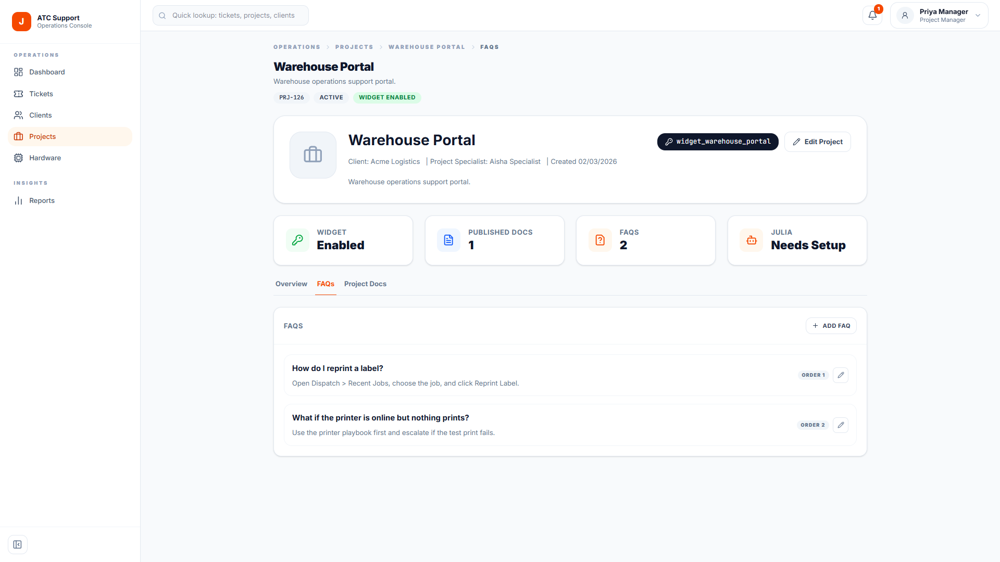
2. Click **Add FAQ**, provide the question/answer pair, and set its display sorting order.
3. Switch to the **Docs** tab to upload or write longer-form runbooks and operational documentation.
   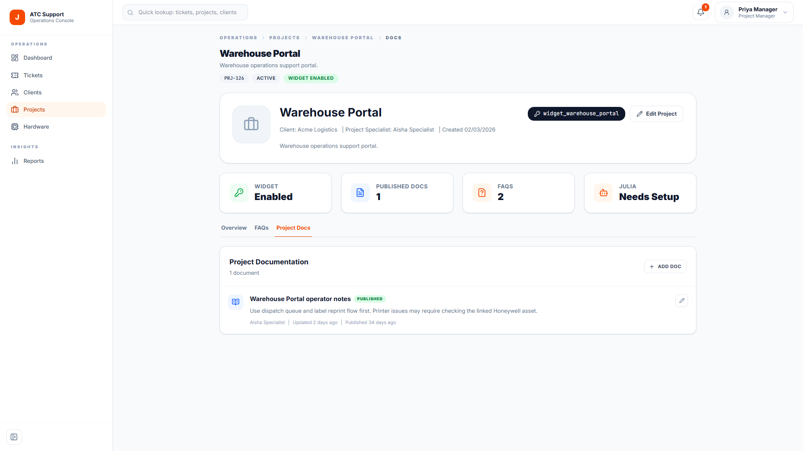
4. Ensure the status is set to **Published** for the document to be ingested by Julia AI.

### 5. Expected Outcome
The client-facing portal reflects the updated FAQs, and Julia AI can now answer questions referencing the newly published documentation.

### 6. Troubleshooting / Edge Cases
- **Draft Status:** Docs marked as 'Draft' are entirely hidden from the AI context and end-users.

### 7. Related SOPs
- SOP-005: Configuring Julia AI

---

## SOP-007: Hardware Asset Management

### 1. Purpose
To maintain a catalog of supported hardware and track specific deployed assets belonging to a client.

### 2. Scope
Project Managers (PM) and Support Engineers (SE).

### 3. Prerequisites
- Access to the Hardware sections of the console.

### 4. Step-by-step Procedure
1. To manage catalog definitions, go to the global **Hardware** section in the main navigation to define Brands and Models.
   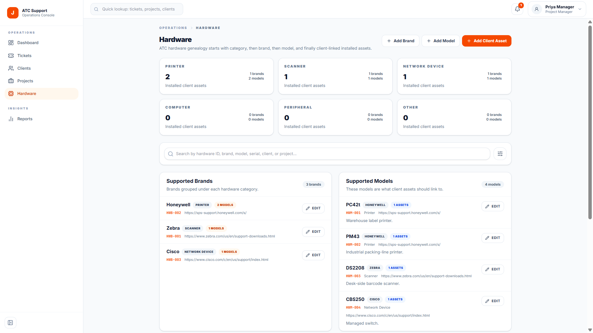
2. Add necessary definitions (e.g., Printers, Scanners) and specifications.
   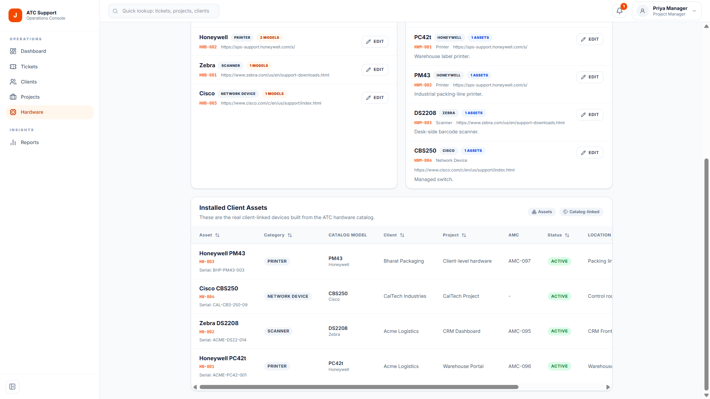
3. To assign a specific unit to a client, navigate to the **Clients** list, open a client, and switch to the **Hardware** tab.
   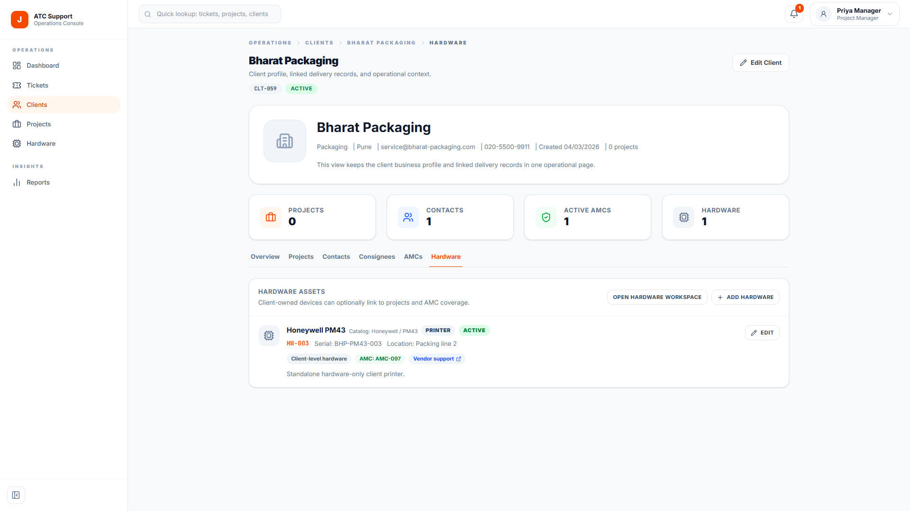
4. Link the asset by entering its serial number, model, and status (Active/Retired).

### 5. Expected Outcome
A comprehensive inventory is mapped to clients, enabling hardware-specific support sessions and topic scoping.

### 6. Troubleshooting / Edge Cases
- Make sure to categorize legacy hardware as 'Retired' rather than deleting it if past tickets reference it.

### 7. Related SOPs
- SOP-008: Annual Maintenance Contract (AMC) Management

---

## SOP-008: Annual Maintenance Contract (AMC) Management

### 1. Purpose
To track pre-purchased maintenance hours and contract validities tied to specific hardware and projects.

### 2. Scope
Project Managers (PM).

### 3. Prerequisites
- An active Client.

### 4. Step-by-step Procedure
1. Navigate to the target Client and open the **AMC** tab.
   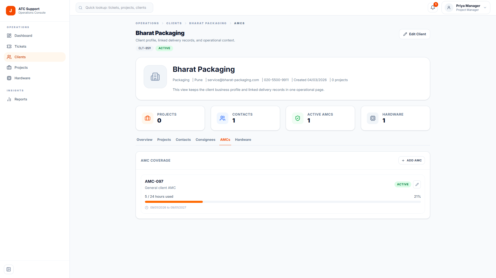
2. Click to register a new contract.
3. Input the valid date range, the total allotted service hours, and attach it to the relevant Hardware Assets and Project scope.
4. Save the contract details.

### 5. Expected Outcome
The system tracks the expiration date and hour consumption for the client's support agreement.

### 6. Troubleshooting / Edge Cases
- Ensure AMCs are transitioned to 'Expired' once the end date is breached to alert agents during ticket triage.

### 7. Related SOPs
- SOP-007: Hardware Asset Management

---

## SOP-009: Widget Embed Flow

### 1. Purpose
To instruct clients on how to embed the ATC Support widget into their external websites.

### 2. Scope
Project Managers (PM), Client IT Teams.

### 3. Prerequisites
- A properly configured Project with Julia AI enabled.
- A generated `widgetKey`.

### 4. Step-by-step Procedure
1. Navigate to the project settings to copy the generated script tag.
2. Instruct the client to insert the following HTML tag before the closing `</body>` tag on their website:
   ```html
   <script src="https://<ATC_SUPPORT_DOMAIN>/widget.js" data-widget-key="YOUR_PROJECT_WIDGET_KEY" defer></script>
   ```
3. Ensure the client's domains are added to the **Widget Allowed Domains** list in the project settings.
   *[Screenshot pending — ATC_Support_SS/sop-009-step3.png]*

### 5. Expected Outcome
The floating support widget appears on the client's web properties and successfully communicates with the ATC backend.

### 6. Troubleshooting / Edge Cases
- If the widget throws a CORS or 403 error, verify the `Widget Allowed Domains` configuration.

### 7. Related SOPs
- SOP-004: Creating a New Project and Generating a Widget Key

---

## SOP-010: Julia AI Escalation to Ticket

### 1. Purpose
To capture the flow when an automated Julia AI session fails to resolve an issue, creating an actionable human support request.

### 2. Scope
End Users (Customers).

### 3. Prerequisites
- An active Chat Session or Support Session with Julia.

### 4. Step-by-step Procedure
1. The user interacts with Julia. When Julia cannot provide a resolution, it offers the Escalation Hint.
2. The user clicks "Escalate to Support" within the widget interface.
   *[Screenshot pending — ATC_Support_SS/sop-010-step2.png]*
3. The widget packages the Chat Session history, AI confidence summary, and user contact details.
4. The system automatically creates a `NEW` Ticket.

### 5. Expected Outcome
A ticket is deposited into the SE inbound queue containing the full context of the AI interaction.

### 6. Troubleshooting / Edge Cases
- Ensure users provide an email address during the widget session; otherwise, the ticket cannot be linked to a contact.

### 7. Related SOPs
- SOP-011: Support Ticket Triage and Queue Management

---

## SOP-011: Support Ticket Triage and Queue Management

### 1. Purpose
To identify, categorize, prioritize, and assign incoming tickets escalating from widgets or emails.

### 2. Scope
Support Engineers (SE), Project Managers (PM).

### 3. Prerequisites
- SE access level.

### 4. Step-by-step Procedure
1. Log in and navigate to the **Tickets** section (Inbound Queue).
   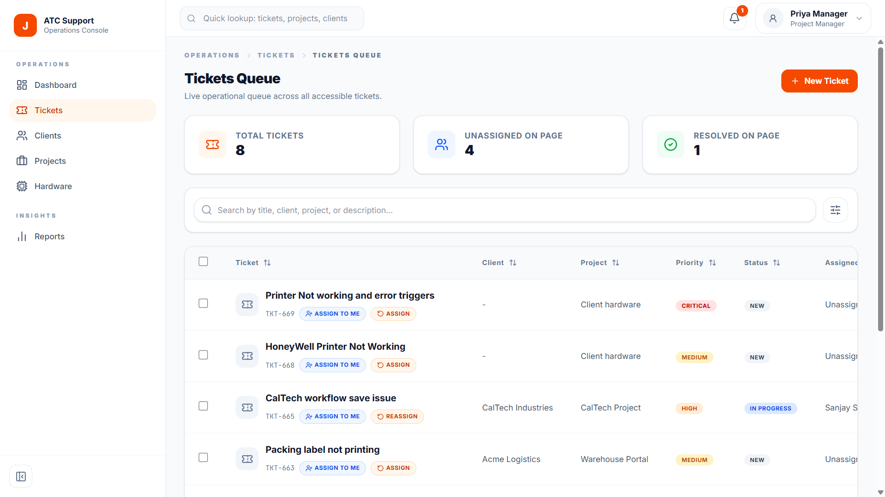
2. Filter the view by `Status: NEW` or `Status: UNASSIGNED`.
3. Open a ticket to view the detail pane.
   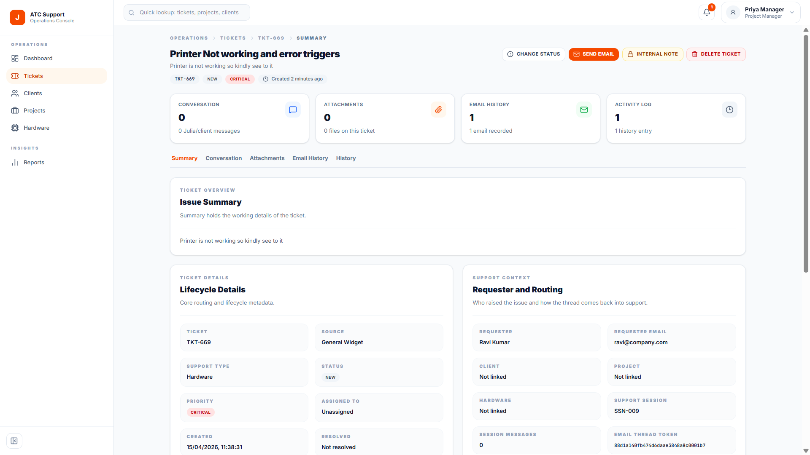
4. Review the AI Resolution Summary and the chat session logs.
5. Set the Ticket Priority (Low, Medium, High, Critical).
6. Assign the ticket to yourself or another SE by using the assignment action button.

### 5. Expected Outcome
The ticket transitions to `ASSIGNED` and is claimed by an agent capable of resolving the issue.

### 6. Troubleshooting / Edge Cases
- Agents with `PROJECT_SCOPED` restrictions will only see tickets originating from their assigned projects.

### 7. Related SOPs
- SOP-012: Ticket Escalation
- SOP-013: Replying to and Resolving a Ticket

---

## SOP-012: Ticket Escalation

### 1. Purpose
To formally pass a ticket from a first-responder (SE) to a more senior engineer or project lead.

### 2. Scope
Support Engineers (SE1, SE2).

### 3. Prerequisites
- An `IN_PROGRESS` or `ASSIGNED` ticket you currently own.

### 4. Step-by-step Procedure
1. Open the Ticket detail view.
2. Navigate to the actions menu and click **Escalate**.
3. Provide an internal note explaining why the escalation is necessary.
   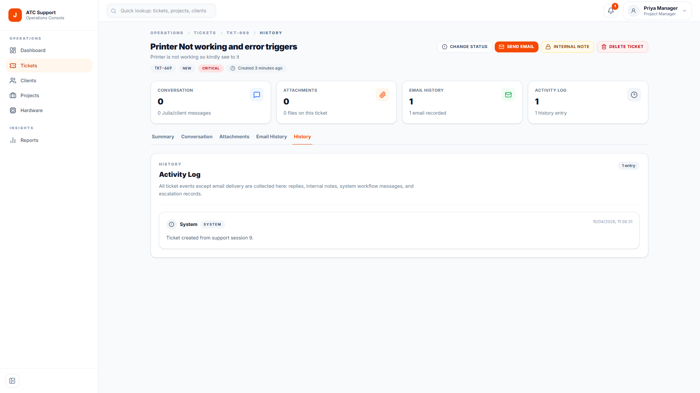
4. The ticket status updates to `ESCALATED` and is routed to a higher-tier SE or the designated Project Lead.

### 5. Expected Outcome
The system records an Escalation Event in the ticket history and alerts the newly assigned party.

### 6. Troubleshooting / Edge Cases
- Once escalated, ensure any ongoing external communication is temporarily paused until the new owner reviews the thread.

### 7. Related SOPs
- SOP-011: Support Ticket Triage and Queue Management

---

## SOP-013: Replying to and Resolving a Ticket

### 1. Purpose
To communicate with the requester and ultimately close out the support request.

### 2. Scope
Support Engineers (SE).

### 3. Prerequisites
- An `IN_PROGRESS` assigned ticket.

### 4. Step-by-step Procedure
1. Open the Ticket Detail interface.
   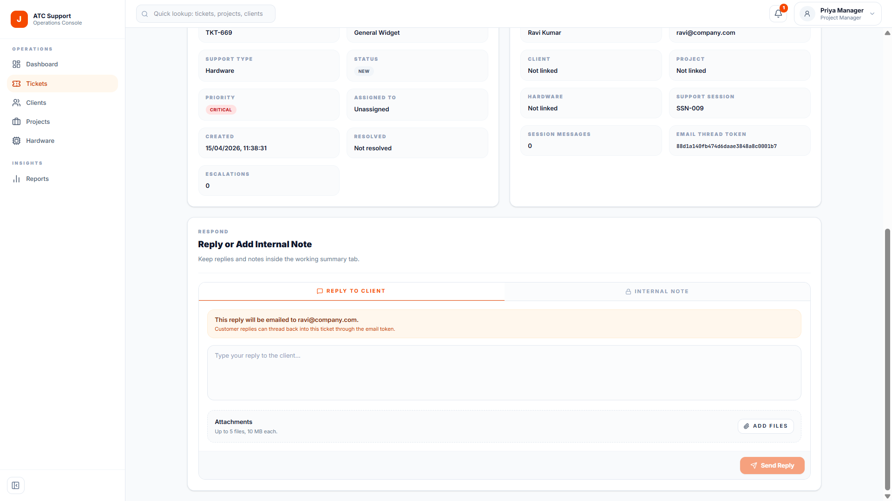
2. Use the message composer to draft a response. You can toggle between `Public Reply` (sent to customer) and `Internal Note` (agents only).
3. Post the reply. The system sends an email.
4. If awaiting a response from the user, transition the status to `WAITING_ON_CUSTOMER`.
5. Once the issue is resolved, click the **Resolve** action, provide a closing summary, and finalize the ticket.

### 5. Expected Outcome
The customer receives the update or resolution notice via email, and the ticket status is updated to `RESOLVED`.

### 6. Troubleshooting / Edge Cases
- If a customer replies via email to a `RESOLVED` ticket, it will automatically shift back to `REOPENED`.

### 7. Related SOPs
- SOP-014: Email Thread Handling

---

## SOP-014: Email Thread Handling

### 1. Purpose
To audit and verify the delivery status of inbound and outbound communication streams attached to a ticket.

### 2. Scope
Support Engineers (SE), Project Managers (PM).

### 3. Prerequisites
- A ticket with external communications.

### 4. Step-by-step Procedure
1. Open the target Ticket's details.
2. Navigate to the **Emails / Timeline** view tab.
   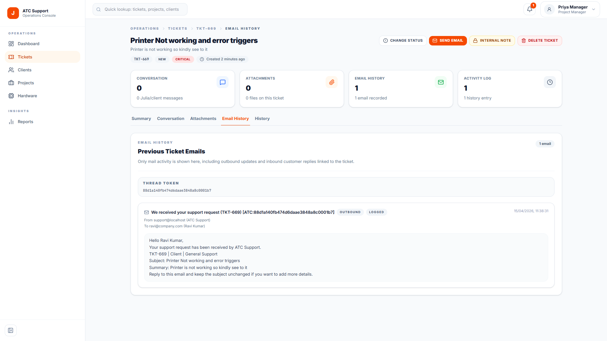
3. Review the logs to confirm the `SENT` or `LOGGED` status of outbound notifications.
4. Verify that inbound `RECEIVED` emails were properly mapped to the internal `TicketMessage` thread.

### 5. Expected Outcome
Agents can diagnose if a client failed to receive an expected communication due to an SMTP bounce or filtering issue.

### 6. Troubleshooting / Edge Cases
- Look for thread routing tokens (e.g., `[ATC:xxxx]`) in the subject lines. If these are stripped by external mail clients, manual re-association may be required.

### 7. Related SOPs
- SOP-013: Replying to and Resolving a Ticket

---

## SOP-015: Notification Management

### 1. Purpose
To ensure agents are alerted to critical workflow transitions without constantly monitoring the queue map.

### 2. Scope
Support Engineers (SE), Project Managers (PM).

### 3. Prerequisites
- Active agent session.

### 4. Step-by-step Procedure
1. Check the Notification Bell icon in the top header of the agent dashboard.
   *[Screenshot pending — ATC_Support_SS/sop-015-step1.png]*
2. Review newly received alerts (e.g., `TICKET_ASSIGNED`, `TICKET_CUSTOMER_REPLIED`).
3. Click on a notification to navigate directly to the resulting ticket or action item.
4. Dismiss notifications or select "Mark All as Read."

### 5. Expected Outcome
Agents are informed of asynchronous updates promptly.

### 6. Troubleshooting / Edge Cases
- Ensure browser notifications are enabled if pop-up toast alerts are desired while tabbed out.

### 7. Related SOPs
- SOP-011: Support Ticket Triage and Queue Management

---

## SOP-016: Reports and Dashboard Usage

### 1. Purpose
To analyze ticket volume, agent performance, resolution times, and hardware failure trends.

### 2. Scope
Project Managers (PM), Senior IT Leadership.

### 3. Prerequisites
- PM access level or specifically permitted SE roles.

### 4. Step-by-step Procedure
1. From the sidebar, navigate to the **Reports** section.
   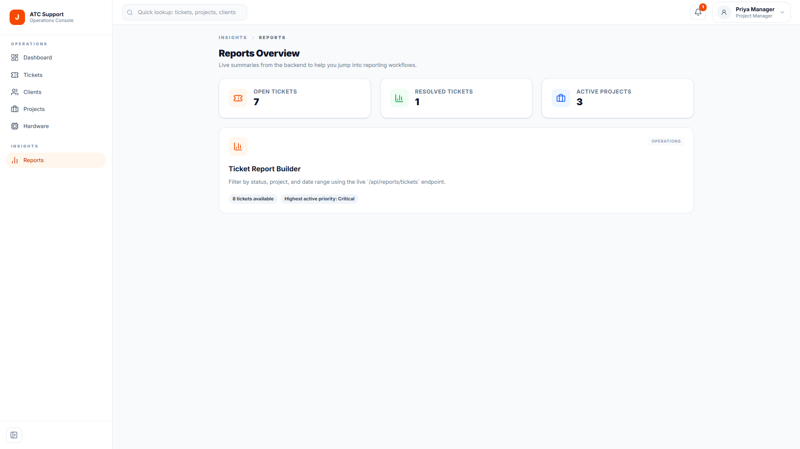
2. Use the timeline constraints and filtering tools (by Project, Client, Assignee) to scope the dataset.
3. Review the aggregated metrics and charts.
4. To view the raw ticketing data behind the charts, switch to the list view breakdown.
   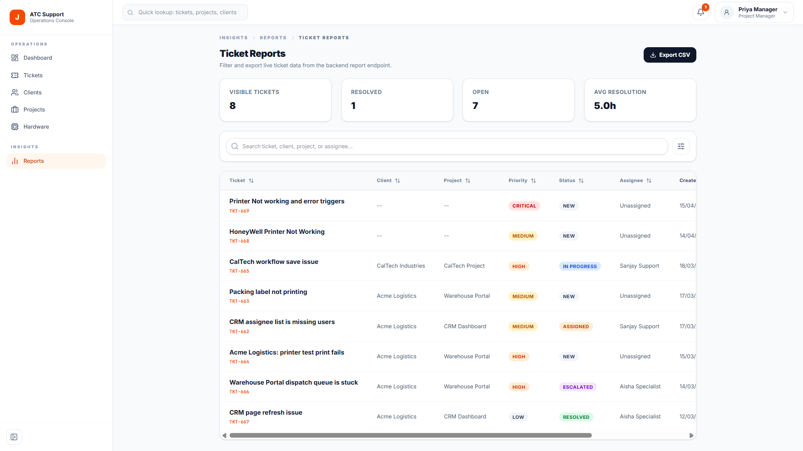
5. Export the dataset via CSV if external analysis (e.g., Excel/BI) is required.

### 5. Expected Outcome
Administrators derive actionable intelligence regarding SLA compliance and product reliability.

### 6. Troubleshooting / Edge Cases
- Large date ranges may take a moment to query. Use granular filters when investigating specific anomalies.

### 7. Related SOPs
- N/A

---

## SOP-017: User and Role Management

### 1. Purpose
To onboard, modify, and terminate internal team member access to the platform.

### 2. Scope
Project Managers (PM).

### 3. Prerequisites
- PM access level.

### 4. Step-by-step Procedure
1. Navigate to the **Users / Account Management** pane.
   *[Screenshot pending — ATC_Support_SS/sop-017-step1.png]*
2. Click to invite or **Create a new internal user**.
3. Supply their Name, Email, and assign a temporary password.
4. Define the Role (`PM` or `SE`).
5. For SEs, define their tier (`SE1`, `SE2`, `SE3`), scope mode (`GLOBAL` vs `PROJECT`), and assignment authority.
6. Save the user profile. To disable access, toggle their status to `INACTIVE`.

### 5. Expected Outcome
The user hierarchy accurately mirrors organizational authorization boundaries, securing client data.

### 6. Troubleshooting / Edge Cases
> ⚠️ **Warning:** Never delete user records associated with historical tickets to preserve auditing integrity; use the `INACTIVE` state instead.

### 7. Related SOPs
- SOP-001: User Login and Session Management

---
*End of Document*
