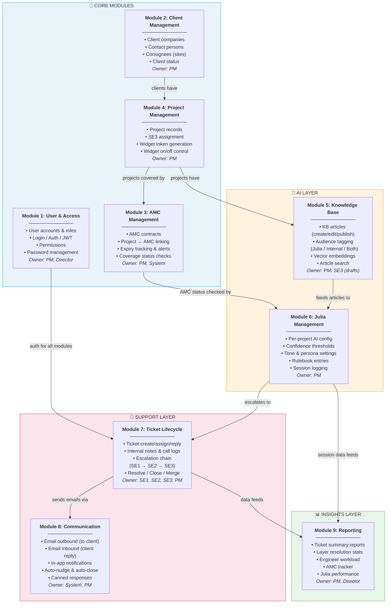
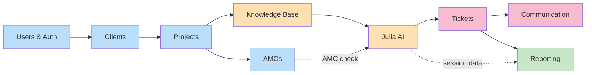

# Diagram 1: Module Map

> **Purpose:** Shows the PM all 9 modules of the system, what each one owns, and how they relate to each other.
>
> **PM signs off on:** "These are the 9 modules. Nothing is missing. The boundaries are correct."

---

## How to render

Copy the mermaid code block below and paste it into [mermaid.live](https://mermaid.live) → export as PNG/SVG.

---

## Module Map — Full System

---

## Module Dependency Summary (Simplified)

---

## What This Diagram Tells the PM

1. **4 layers**: Core data (blue) → AI layer (orange) → Support layer (pink) → Insights (green)
2. **Data flows left-to-right**: You can't have Tickets without Projects. You can't have Julia without KB articles. Everything builds on the layer before it.
3. **9 modules, clear boundaries**: Each module owns specific things. No overlap. If PM asks "where does AMC expiry live?" — Module 3, not Module 7.
4. **Build order follows the arrows**: You build blue first, then orange, then pink, then green. This is why the sprint plan is ordered the way it is.
