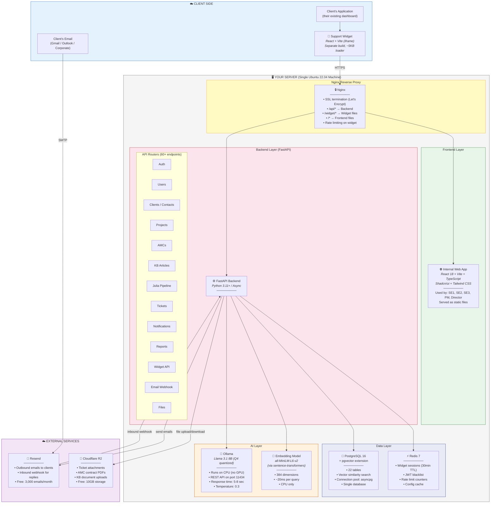
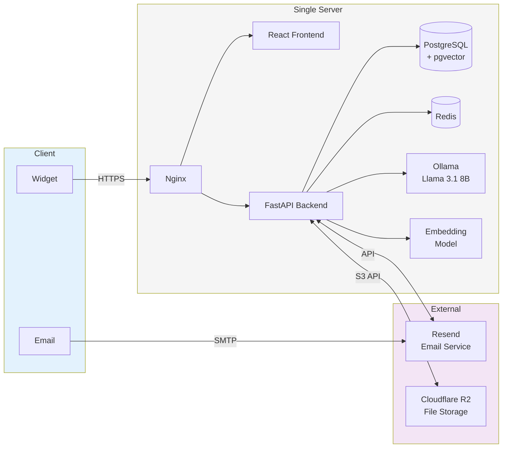

# Diagram 2: System Architecture (with Tech Stack & Infrastructure)

> **Purpose:** Shows the PM every technical component, what tools they use, and how they connect. This is the centerpiece architecture diagram.
>
> **PM signs off on:** "This is the architecture. These are the tools. This is how everything connects."

---

## How to render

Copy each mermaid code block → paste into [mermaid.live](https://mermaid.live) → export as PNG/SVG.

---

## System Architecture — Full View

---

## Simplified Architecture (For Quick Reference)

---

## Why Each Tool Was Chosen

| Component | Chosen Tool | Why This Over Alternatives |
|---|---|---|
| **Backend** | FastAPI (Python) | Julia's AI pipeline is Python-native. Embedding models, Ollama client, pgvector — all first-class in Python. No bridge needed |
| **Frontend** | React + Vite | Largest component ecosystem. Vite is fast. TypeScript for type safety |
| **UI Library** | Shadcn/ui + Tailwind | Not a heavy framework — individual components, fully customizable, clean look |
| **Database** | PostgreSQL 16 | Relational + pgvector = no separate vector DB needed. One database does everything |
| **Vector Search** | pgvector (extension) | Lives inside PostgreSQL. No extra infrastructure. Handles thousands of articles |
| **LLM** | Ollama + Llama 3.1 8B | Runs locally on CPU. No API costs. No data leaves the server. Easy model swapping |
| **Embeddings** | all-MiniLM-L6-v2 | 384 dimensions, 20ms per query, CPU-friendly. Industry standard for RAG |
| **Cache** | Redis | Widget sessions need fast read/write. JWT blacklist. Rate limiting. Battle-tested |
| **Email** | Resend | Developer-friendly API, webhook support for inbound parsing, good deliverability |
| **File Storage** | Cloudflare R2 | S3-compatible, no egress fees, free tier covers MVP |
| **Reverse Proxy** | Nginx | SSL termination, routing, rate limiting. Standard |
| **Containerization** | Docker Compose | Everything in containers. One command to start all services |

---

## What This Diagram Tells the PM

1. **Everything runs on ONE server** — no cloud sprawl, no multi-region complexity
2. **No GPU** — Ollama runs on CPU. Slower responses (5-8 sec) but zero GPU cost
3. **One database** — PostgreSQL handles both relational data AND vector search (pgvector)
4. **Only 2 external services** — Resend (email) and R2 (files). Both have free tiers
5. **The AI is local** — no client data leaves the server. Critical for industrial clients
6. **Monthly cost: ₹4,000-6,000** — just the server rental
