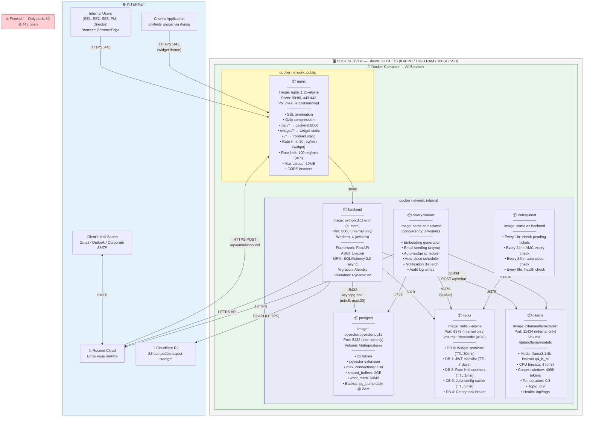
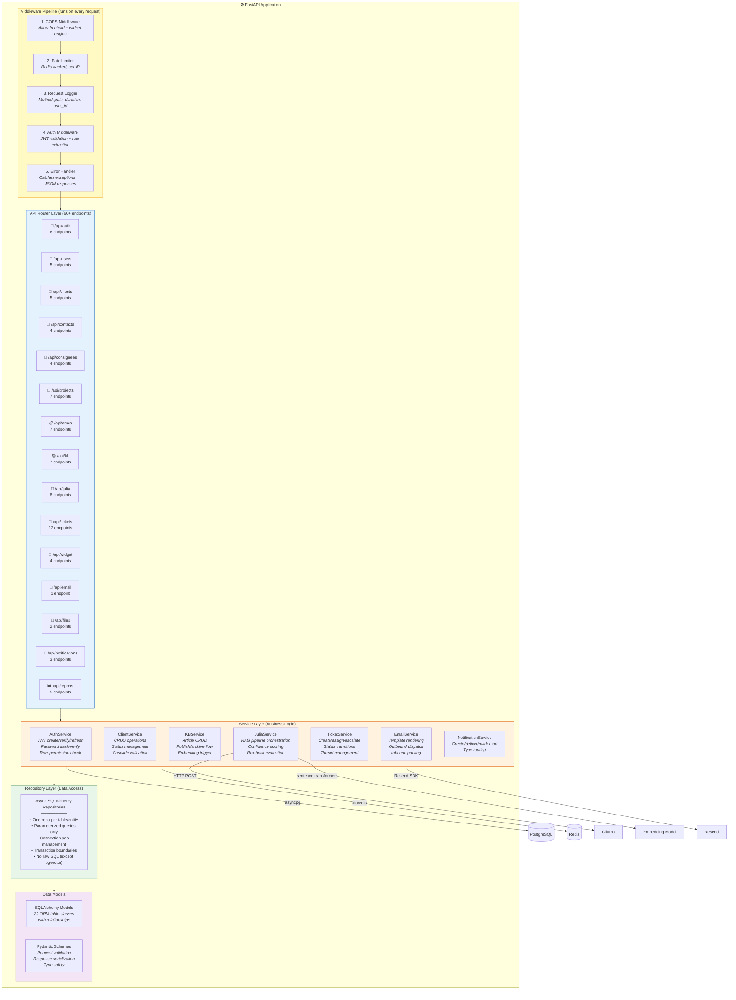
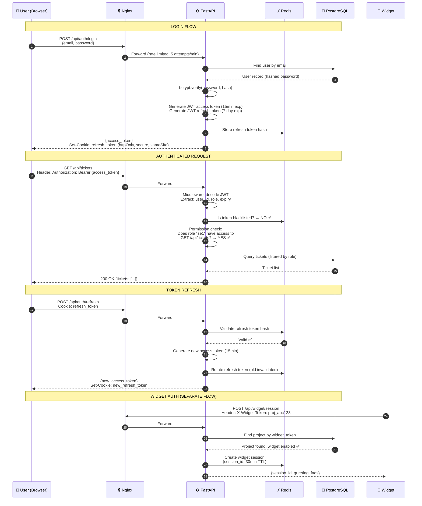
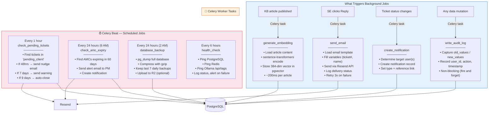
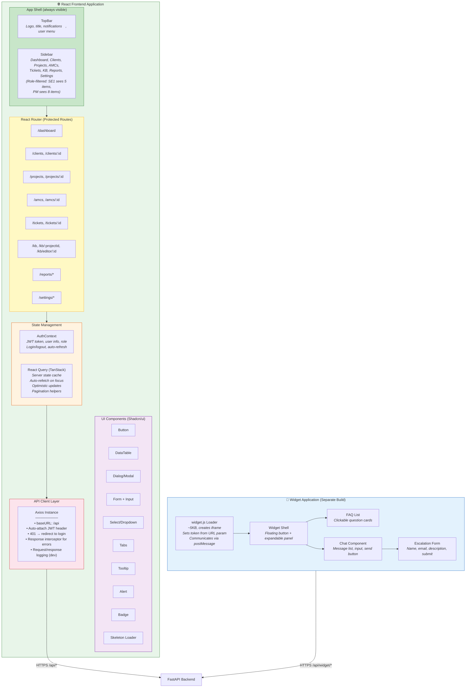
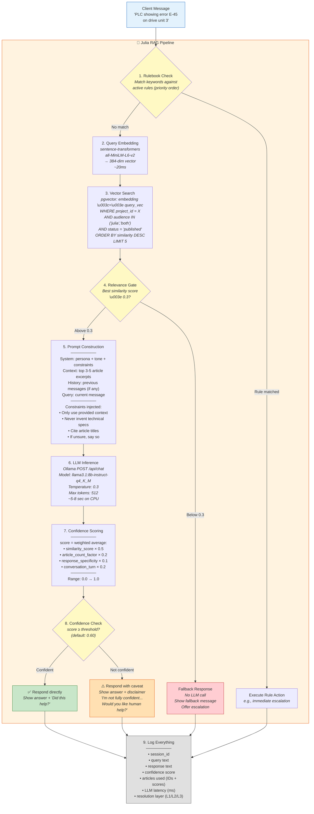
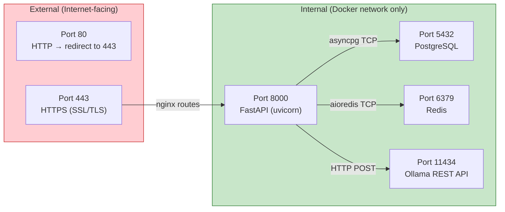

# Diagram 2B: System Architecture — Deep Dive

> **Purpose:** A production-level detailed view showing internal backend layers, middleware pipeline, Docker services with ports, background workers, security boundaries, and every protocol/connection.
>
> **This complements the high-level diagram in `02_System_Architecture.md`.**

---

## How to render

Copy each mermaid code block → paste into [mermaid.live](https://mermaid.live) → export as PNG/SVG.

---

## 1. Infrastructure & Docker Compose Layout

---

## 2. Backend Internal Architecture (Layered)

---

## 3. Authentication & Security Architecture

---

## 4. Background Workers & Scheduled Jobs

---

## 5. Frontend Application Architecture

---

## 6. Julia RAG Pipeline — Internal Architecture

---

## 7. Docker Compose Services Summary

| Service | Image | Internal Port | CPU | RAM | Disk | Depends On |
|---|---|---|---|---|---|---|
| `nginx` | nginx:1.25-alpine | 80, 443 | 0.5 core | 256MB | 100MB | backend |
| `backend` | python:3.11-slim (custom) | 8000 | 1 core | 1GB | 500MB | postgres, redis, ollama |
| `celery-worker` | same as backend | — | 1 core | 1GB | — | postgres, redis, ollama |
| `celery-beat` | same as backend | — | 0.25 core | 256MB | — | redis |
| `postgres` | pgvector/pgvector:pg16 | 5432 | 1 core | 2GB | 50GB | — |
| `redis` | redis:7-alpine | 6379 | 0.25 core | 512MB | 1GB | — |
| `ollama` | ollama/ollama:latest | 11434 | 4 cores | 6GB | 5GB (model) | — |
| **Total** | | | **8 cores** | **~11GB** | **~57GB** | |

---

## 8. Network & Port Map

---

## What This Tells the PM (Beyond the High-Level Diagram)

1. **7 Docker containers** — not just "a server," but 7 isolated services managed by Docker Compose
2. **Background workers handle heavy lifting** — embedding generation, email sending, and scheduled jobs don't block the API
3. **4-layer backend** — Middleware → Routers → Services → Repositories. Clean separation, testable
4. **Security is layered** — Firewall → Nginx rate limiting → JWT validation → Role permission check → Parameterized queries
5. **Two separate React apps** — internal web app (heavy, full Shadcn/ui) and widget (lightweight, ~5KB loader)
6. **Server needs: 8 vCPU, 16GB RAM** — Ollama alone needs 4 cores + 6GB RAM for the quantized Llama model
7. **Only 2 ports face the internet** — 80 and 443. Everything else is isolated in Docker's internal network
8. **Automated maintenance** — daily backups, hourly ticket nudge checks, AMC expiry alerts, health monitoring — all via Celery Beat
