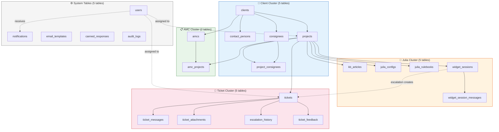

# Diagram 3: Entity Relationship Diagram (Database)

> **Purpose:** Shows the PM all 22 tables, their key columns, and how they relate to each other.
>
> **PM signs off on:** "This is the data structure. These are all the entities. The relationships are correct."

---

## How to render

Copy each mermaid code block → paste into [mermaid.live](https://mermaid.live) → export as PNG/SVG.

---

## Full ER Diagram — All 22 Tables

```mermaid
erDiagram
    users {
        UUID id PK
        VARCHAR email UK
        VARCHAR password_hash
        VARCHAR full_name
        VARCHAR role "se1 | se2 | se3 | pm | director"
        VARCHAR status "active | inactive"
        BOOLEAN first_login
    }

    clients {
        UUID id PK
        VARCHAR company_name
        VARCHAR industry
        VARCHAR city
        TEXT address
        VARCHAR status "active | inactive"
    }

    contact_persons {
        UUID id PK
        UUID client_id FK
        VARCHAR name
        VARCHAR email UK
        VARCHAR designation
        BOOLEAN is_primary
        VARCHAR status "active | inactive"
    }

    consignees {
        UUID id PK
        UUID client_id FK
        VARCHAR site_name
        VARCHAR city
        TEXT address
    }

    projects {
        UUID id PK
        UUID client_id FK
        UUID assigned_se3_id FK
        VARCHAR name
        VARCHAR widget_token UK
        BOOLEAN widget_enabled
        VARCHAR status "active | inactive"
    }

    project_consignees {
        UUID id PK
        UUID project_id FK
        UUID consignee_id FK
    }

    amcs {
        UUID id PK
        UUID client_id FK
        VARCHAR contract_number
        DATE start_date
        DATE end_date
        VARCHAR document_url
        VARCHAR status "active | upcoming | expired"
    }

    amc_projects {
        UUID id PK
        UUID amc_id FK
        UUID project_id FK
    }

    kb_articles {
        UUID id PK
        UUID project_id FK
        UUID author_id FK
        VARCHAR title
        TEXT content
        VARCHAR audience "julia | internal | both"
        VARCHAR status "draft | published | archived"
        VECTOR embedding "384 dimensions"
    }

    julia_configs {
        UUID id PK
        UUID project_id FK
        VARCHAR persona_name
        TEXT greeting_message
        DECIMAL confidence_threshold
        VARCHAR tone "professional | friendly | technical"
        INTEGER max_turns
    }

    julia_rulebooks {
        UUID id PK
        UUID project_id FK
        VARCHAR rule_name
        TEXT trigger_condition
        TEXT action_instruction
        INTEGER priority
        VARCHAR status "active | inactive"
    }

    widget_sessions {
        UUID id PK
        UUID project_id FK
        UUID contact_id FK
        VARCHAR resolution_layer "L1 | L2 | L3"
        BOOLEAN resolved
        UUID ticket_id FK
        TIMESTAMP started_at
    }

    widget_session_messages {
        UUID id PK
        UUID session_id FK
        INTEGER message_index
        VARCHAR role "user | assistant | system"
        TEXT content
        DECIMAL confidence_score
        INTEGER llm_latency_ms
    }

    tickets {
        UUID id PK
        VARCHAR ticket_number UK "TKT-0001"
        UUID project_id FK
        UUID client_id FK
        UUID contact_id FK
        UUID assigned_to FK
        VARCHAR subject
        VARCHAR status "new | in_progress | pending_client | resolved | closed"
        VARCHAR priority "low | medium | high | critical"
        VARCHAR current_level "se1 | se2 | se3"
        VARCHAR source "widget | manual | email"
        UUID widget_session_id FK
        TEXT resolution_summary
    }

    ticket_messages {
        UUID id PK
        UUID ticket_id FK
        UUID author_id FK
        VARCHAR author_type "se | client | system"
        VARCHAR message_type "reply | internal_note | call_log | escalation_note"
        TEXT content
    }

    ticket_attachments {
        UUID id PK
        UUID ticket_id FK
        UUID message_id FK
        VARCHAR file_name
        VARCHAR storage_url
        UUID uploaded_by FK
    }

    escalation_history {
        UUID id PK
        UUID ticket_id FK
        VARCHAR from_level
        VARCHAR to_level
        UUID from_user_id FK
        UUID to_user_id FK
        TEXT note
    }

    ticket_feedback {
        UUID id PK
        UUID ticket_id FK
        INTEGER rating "1-5"
        TEXT comment
        VARCHAR feedback_token UK
    }

    notifications {
        UUID id PK
        UUID user_id FK
        VARCHAR type
        VARCHAR title
        TEXT message
        VARCHAR reference_type
        UUID reference_id
        BOOLEAN is_read
    }

    email_templates {
        UUID id PK
        VARCHAR template_key UK
        VARCHAR subject_template
        TEXT body_template
    }

    canned_responses {
        UUID id PK
        VARCHAR title
        VARCHAR category
        TEXT content
        UUID created_by FK
    }

    audit_logs {
        UUID id PK
        UUID user_id FK
        VARCHAR action
        VARCHAR entity_type
        UUID entity_id
        JSONB old_values
        JSONB new_values
    }

    %% ═══════════════════════════════
    %% RELATIONSHIPS
    %% ═══════════════════════════════

    %% Client cluster
    clients ||--o{ contact_persons : "has contacts"
    clients ||--o{ consignees : "has sites"
    clients ||--o{ projects : "has projects"
    clients ||--o{ amcs : "has contracts"

    %% Project connections
    projects ||--o{ project_consignees : "deployed at"
    consignees ||--o{ project_consignees : "hosts"
    projects }o--|| users : "assigned SE3"

    %% AMC connections
    amcs ||--o{ amc_projects : "covers"
    projects ||--o{ amc_projects : "covered by"

    %% KB & Julia
    projects ||--|| julia_configs : "has config"
    projects ||--o{ julia_rulebooks : "has rules"
    projects ||--o{ kb_articles : "has articles"
    users ||--o{ kb_articles : "authored by"

    %% Widget sessions
    projects ||--o{ widget_sessions : "has sessions"
    contact_persons ||--o{ widget_sessions : "initiated by"
    widget_sessions ||--o{ widget_session_messages : "contains"

    %% Tickets
    projects ||--o{ tickets : "has tickets"
    clients ||--o{ tickets : "reported by"
    contact_persons ||--o{ tickets : "raised by"
    users ||--o{ tickets : "assigned to"
    widget_sessions ||--o| tickets : "created"
    tickets ||--o{ ticket_messages : "has thread"
    tickets ||--o{ ticket_attachments : "has files"
    tickets ||--o{ escalation_history : "escalated"
    tickets ||--o| ticket_feedback : "has feedback"

    %% Messages
    ticket_messages ||--o{ ticket_attachments : "has files"
    users ||--o{ ticket_messages : "authored"

    %% System-wide
    users ||--o{ notifications : "receives"
    users ||--o{ audit_logs : "performed"
    users ||--o{ canned_responses : "created"
```

---

## Table Clusters (Simplified View)

---

## Table Growth Summary

| Cluster | Tables | Row Growth | Notes |
|---|---|---|---|
| **Client** | `clients`, `contact_persons`, `consignees`, `projects`, `project_consignees` | Low (10-200 rows each) | Stable data, rarely changes |
| **AMC** | `amcs`, `amc_projects` | Low (10-100 rows) | One AMC per client per year |
| **Julia** | `kb_articles`, `julia_configs`, `julia_rulebooks`, `widget_sessions`, `widget_session_messages` | **High** (sessions grow daily) | Sessions and messages need archival after 12 months |
| **Ticket** | `tickets`, `ticket_messages`, `ticket_attachments`, `escalation_history`, `ticket_feedback` | **High** (messages grow daily) | Core operational data |
| **System** | `users`, `notifications`, `email_templates`, `canned_responses`, `audit_logs` | Mixed (notifications + audit grow fast) | Prune notifications after 6 months |

---

## What This Diagram Tells the PM

1. **22 tables, 1 database** — no separate databases, no separate vector DB
2. **5 clear clusters** — data is logically grouped. Client data → Julia data → Ticket data. Clean separation
3. **Everything connects through `projects`** — projects are the central hub. KB articles belong to projects. Tickets belong to projects. Julia configs belong to projects. Widget sessions belong to projects
4. **High-growth tables are identified** — we know where archival/pruning is needed (sessions, messages, audit logs)
5. **Vector embeddings live inside `kb_articles`** — no separate vector store. pgvector handles it in the same table
