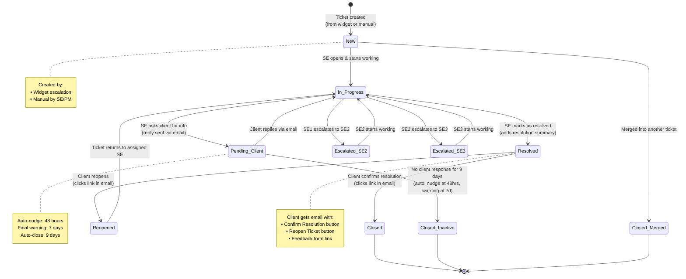
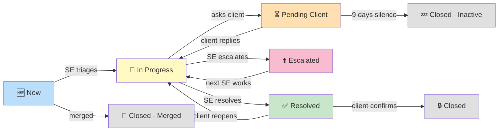
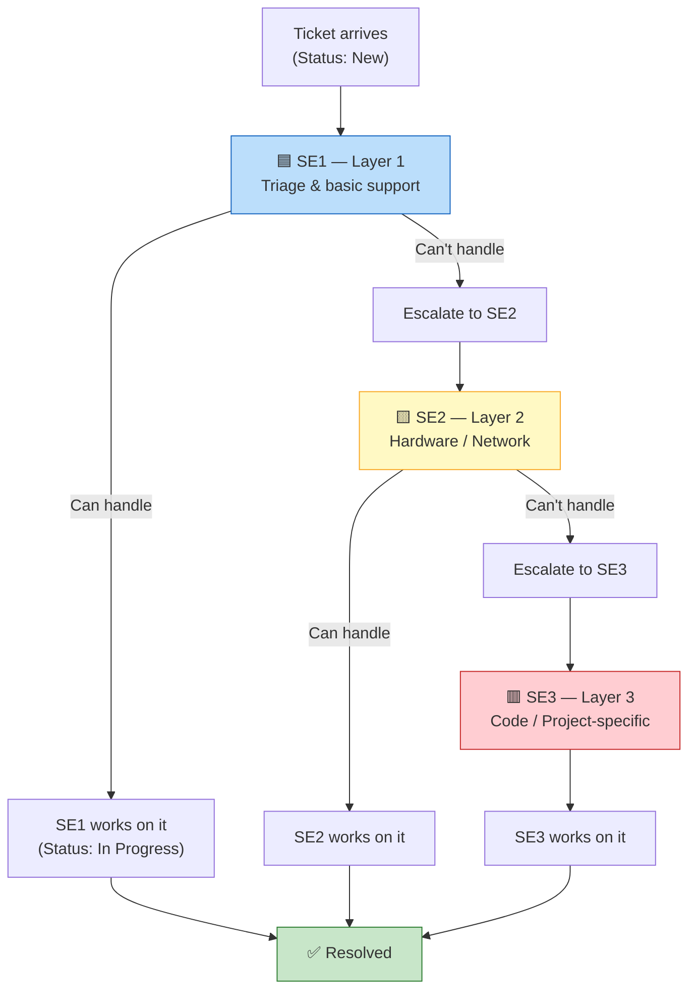

# Diagram 4: Ticket Status Flow (State Diagram)

> **Purpose:** Shows the PM every status a ticket can be in, what action triggers each transition, and who triggers it.
>
> **PM signs off on:** "These are all the ticket states. These transitions are correct. No missing states."

---

## How to render

Copy each mermaid code block → paste into [mermaid.live](https://mermaid.live) → export as PNG/SVG.

---

## Ticket Status Flow — Complete

---

## Simplified Linear Flow (For Quick Reference)

---

## Escalation Sub-Flow

---

## Auto-Close Timeline

```mermaid
gantt
    title Pending Client — Auto-Close Timeline
    dateFormat X
    axisFormat %d

    section Ticket Status
    Pending Client (waiting)        :a1, 0, 48
    First Nudge Email Sent          :milestone, m1, 48, 0
    Still Waiting                   :a2, 48, 168
    Final Warning Email Sent        :milestone, m2, 168, 0
    Last Chance                     :a3, 168, 216
    Auto-Closed (Inactive)          :milestone, m3, 216, 0
```

| Event | Timing | Action |
|---|---|---|
| Ticket enters Pending Client | Day 0 | Waiting for client response |
| First nudge | 48 hours | System sends reminder email |
| Final warning | 7 days | System sends "closing in 48 hours" email |
| Auto-close | 9 days | System closes ticket, notifies PM |

---

## What This Diagram Tells the PM

1. **7 distinct statuses**: New → In Progress → Pending Client → Resolved → Closed / Inactive / Merged
2. **Escalation is lateral, not a status**: The ticket stays "In Progress" when escalated — only the assigned engineer and level changes
3. **Client controls closure**: SE marks as Resolved, but the ticket only becomes Closed when the client confirms. This prevents premature closure
4. **Auto-close prevents ticket rot**: If a client ghosts for 9 days, the system closes it automatically. PM gets notified
5. **Reopen has a 30-day limit**: After 30 days, reopening creates a new ticket with a reference. Old tickets stay clean
