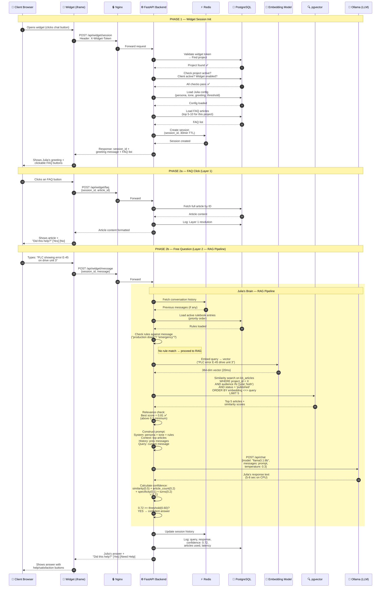
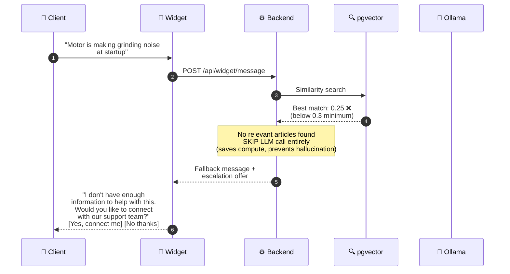
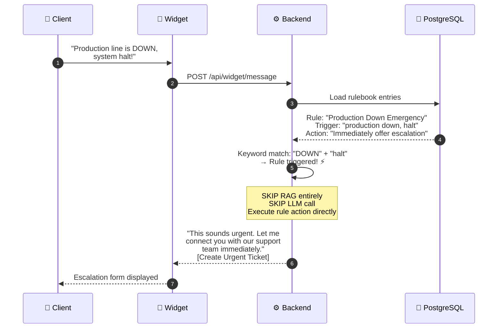

# Diagram 5: Data Flow — Widget → Julia → Answer

> **Purpose:** Shows the PM the exact step-by-step flow when a client asks Julia a question. Every API call, every internal process, every decision point.
>
> **PM signs off on:** "This is how Julia works. These are the steps. The API calls are correct."

---

## How to render

Copy each mermaid code block → paste into [mermaid.live](https://mermaid.live) → export as PNG/SVG.

---

##  

---

## When Julia Is NOT Confident (Below Threshold)

---

## When a Rulebook Triggers (Skips RAG)

---

## What This Diagram Tells the PM

1. **Three pathways exist**: FAQ click (instant, no AI) → RAG answer (5-8 sec, AI) → Escalation (no AI, direct ticket)
2. **Julia doesn't guess**: If no relevant KB articles exist (similarity < 0.3), she skips the LLM entirely and offers human help
3. **Rulebooks bypass everything**: Emergency keywords trigger immediate escalation — no RAG, no LLM delay
4. **Every step is logged**: Session history, confidence scores, articles used, latency — all stored for PM to review
5. **API calls are clear**: Widget only ever calls 3 endpoints: `/session` (init), `/faq` (article), `/message` (question)
6. **CPU-only performance**: Embedding takes ~20ms, LLM takes ~5-8 seconds. Total response time: ~6-9 seconds per question
