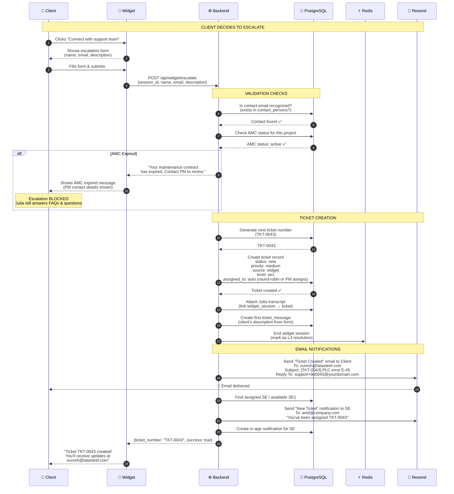
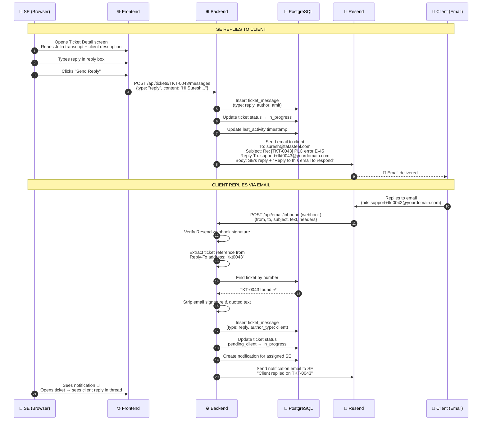
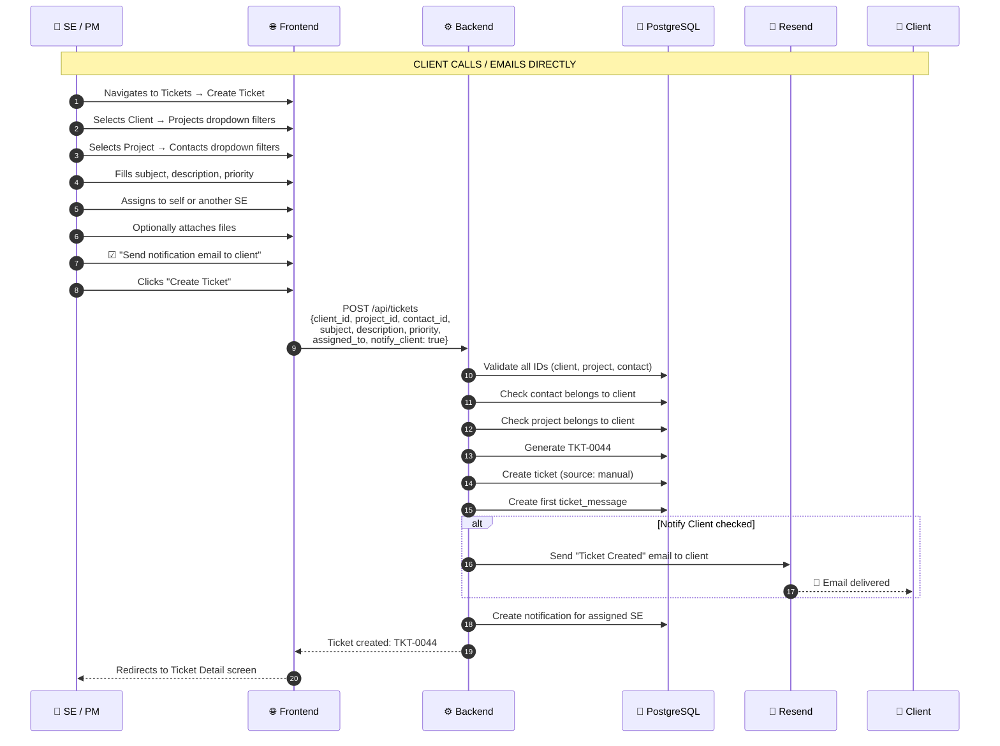
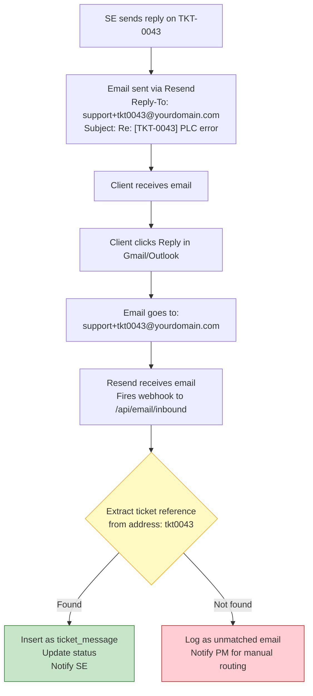

# Diagram 6: Data Flow — Escalation → Ticket → Email → Client Reply

> **Purpose:** Shows the PM the complete chain from when a client escalates through the widget (or an SE creates a ticket manually) all the way through email communication and client replies.
>
> **PM signs off on:** "This is how tickets get created and how email communication works end-to-end."

---

## How to render

Copy each mermaid code block → paste into [mermaid.live](https://mermaid.live) → export as PNG/SVG.

---

## Flow A: Widget Escalation → Ticket Creation

---

## Flow B: SE Replies → Client Gets Email → Client Replies Back

---

## Flow C: Manual Ticket Creation (No Widget)

---

## Email Threading — How Reply Matching Works

---

## What This Diagram Tells the PM

1. **Two ticket creation paths**: Widget (automated, Julia transcript attached) and Manual (SE creates from phone call or email)
2. **AMC is checked on escalation**: No active AMC = no ticket creation through widget. Client gets PM's contact info instead
3. **Email is the communication channel**: Clients never log into the system. They reply to emails. Replies appear in the ticket thread automatically
4. **Ticket matching uses Reply-To address**: `support+tkt0043@yourdomain.com` — the ticket number is embedded. No parsing needed, works with all email clients
5. **Unmatched emails don't get lost**: If a reply can't be matched, PM gets notified and manually routes it
6. **Cascading dropdowns prevent errors**: Client → Project → Contact all filter each other. Can't create a mismatched ticket
