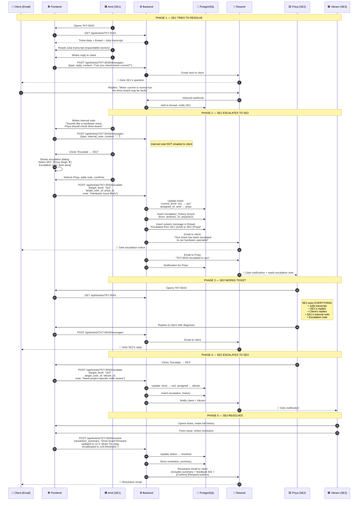
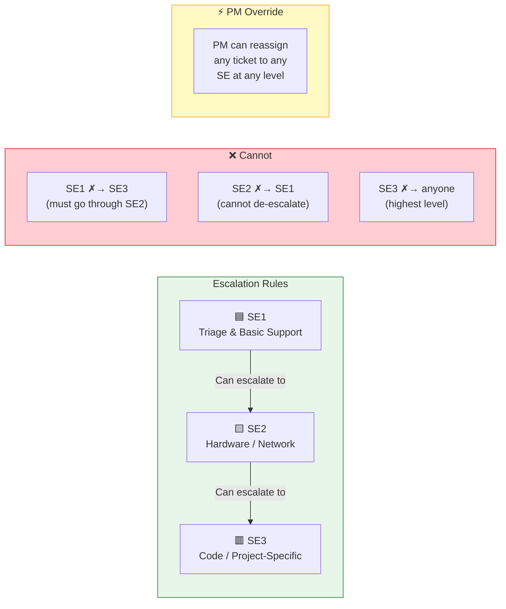
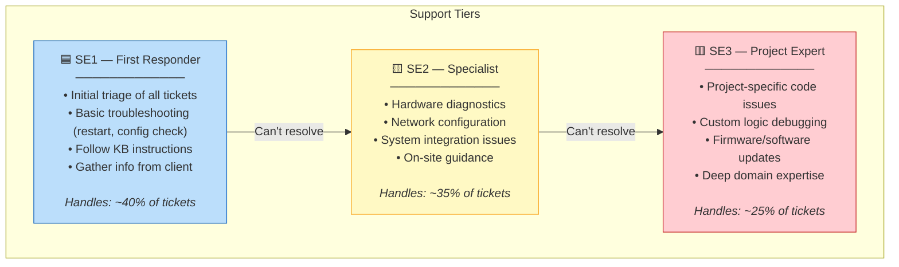

# Diagram 7: Data Flow — SE1 → SE2 → SE3 Escalation

> **Purpose:** Shows the PM exactly what happens when a ticket gets escalated between support engineer tiers, who does what, and what the client sees.
>
> **PM signs off on:** "This is the escalation process. The hand-off is correct. The right people get notified."

---

## How to render

Copy each mermaid code block → paste into [mermaid.live](https://mermaid.live) → export as PNG/SVG.

---

## Full Escalation Sequence: SE1 → SE2 → SE3

---

## Escalation Rules — Who Can Escalate Where

---

## What Each SE Level Handles

---

## What This Diagram Tells the PM

1. **Strict escalation ladder**: SE1 → SE2 → SE3. No skipping. No de-escalation. PM can override
2. **Full context preserved**: When SE2 opens a ticket escalated from SE1, they see everything — Julia transcript, all replies, internal notes, escalation notes. No information loss
3. **Client is notified at every escalation**: "Your ticket has been escalated to our specialist" — client never wonders what's happening
4. **Internal notes stay internal**: SE's can leave notes for each other that the client never sees in email
5. **PM has override power**: Can reassign any ticket to any SE regardless of level — handles edge cases
