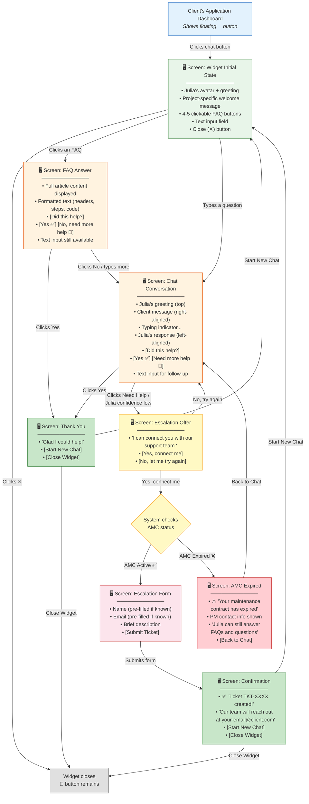

# Diagram 8: Wireflow — Client Uses Widget

> **Purpose:** Shows the PM every screen the client sees and every path they can take through the widget.
>
> **PM signs off on:** "These are the widget screens. These are the user paths. Nothing is missing."

---

## How to render

Copy each mermaid code block → paste into [mermaid.live](https://mermaid.live) → export as PNG/SVG.

---

## Complete Widget Wireflow

---

## Widget States Summary

| # | Screen | When Shown | User Can |
|---|---|---|---|
| 1 | Initial State | Widget opens | Click FAQ, type question, close |
| 2 | FAQ Answer | Clicked a FAQ button | Say "helped" or "need more" |
| 3 | Chat Conversation | Typed a question | Continue chatting, escalate, close |
| 4 | Escalation Offer | Julia can't help or client clicks "Need help" | Accept escalation or go back |
| 5 | Escalation Form | Client accepts, AMC is active | Fill details, submit |
| 6 | AMC Expired | Client accepts, AMC is expired | See PM contact, go back to chat |
| 7 | Confirmation | Ticket created successfully | Start new chat or close |
| 8 | Thank You | Client says FAQ/answer helped | Start new chat or close |

---

## What This Diagram Tells the PM

1. **8 widget states** — every screen the client sees is accounted for
2. **AMC gate is clear** — expired AMC blocks ticket creation but not Julia's answers
3. **No dead ends** — every screen has a path forward or back
4. **Client never gets stuck** — even if Julia fails, escalation is always offered
5. **Pre-filled fields reduce friction** — if contact is known, name and email auto-fill
