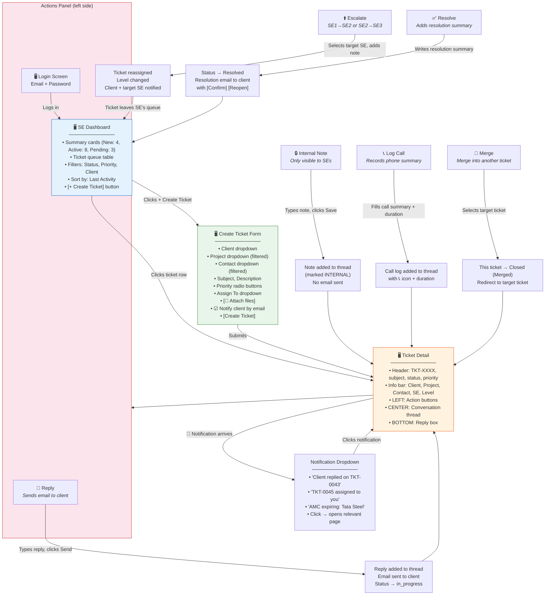

# Diagram 9: Wireflow — SE Handles Ticket

> **Purpose:** Shows the PM every screen an SE sees and every action they take when working a ticket.
>
> **PM signs off on:** "This is the SE workflow. These are the screens. The actions are correct."

---

## How to render

Copy each mermaid code block → paste into [mermaid.live](https://mermaid.live) → export as PNG/SVG.

---

## SE Ticket Handling Wireflow

---

## Thread Message Types (What SE Sees in Conversation)

```mermaid
graph TD
    subgraph THREAD["Conversation Thread (chronological)"]
        T1["📎 JULIA TRANSCRIPT<br/><i>Expandable, grey background</i><br/>Shows full widget conversation"]
        T2["🟢 SYSTEM MESSAGE<br/><i>Centered, grey text</i><br/>'Ticket created from widget escalation'"]
        T3["👤 SE REPLY<br/><i>Right-aligned, blue background</i><br/>'Hi Suresh, can you check motor current?'<br/>[Sent via ✉️]"]
        T4["👤 CLIENT REPLY<br/><i>Left-aligned, white background</i><br/>'Motor current is normal but drive board seems faulty'<br/>[Received via ✉️]"]
        T5["🔒 INTERNAL NOTE<br/><i>Bordered, yellow background</i><br/>'Sounds like hardware issue. Priya should check.'<br/><i>Client cannot see this</i>"]
        T6["📞 CALL LOG<br/><i>Phone icon, light grey</i><br/>'Called Suresh. Confirmed motor overheating.'<br/>Duration: 12 min"]
        T7["⬆️ ESCALATION NOTE<br/><i>System message style</i><br/>'Escalated from SE1 (Amit) to SE2 (Priya)'"]

        T1 --> T2 --> T3 --> T4 --> T5 --> T6 --> T7
    end

    style T1 fill:#f5f5f5,stroke:#9e9e9e
    style T2 fill:#e0e0e0,stroke:#616161
    style T3 fill:#bbdefb,stroke:#1565C0
    style T4 fill:#ffffff,stroke:#9e9e9e
    style T5 fill:#fff9c4,stroke:#F9A825
    style T6 fill:#f5f5f5,stroke:#9e9e9e
    style T7 fill:#e0e0e0,stroke:#616161
```

---

## What This Diagram Tells the PM

1. **Dashboard is work-focused**: SE sees their queue, summary stats, and can jump to any ticket
2. **Ticket Detail is the workhorse screen**: Everything happens here — reply, note, call, escalate, resolve
3. **6 actions on every ticket**: Reply, Internal Note, Log Call, Escalate, Resolve, Merge
4. **7 message types in the thread**: Julia transcript, system messages, SE replies, client replies, internal notes, call logs, escalation notes — all visually distinct
5. **Internal notes never reach the client**: Clearly separated, different background color
