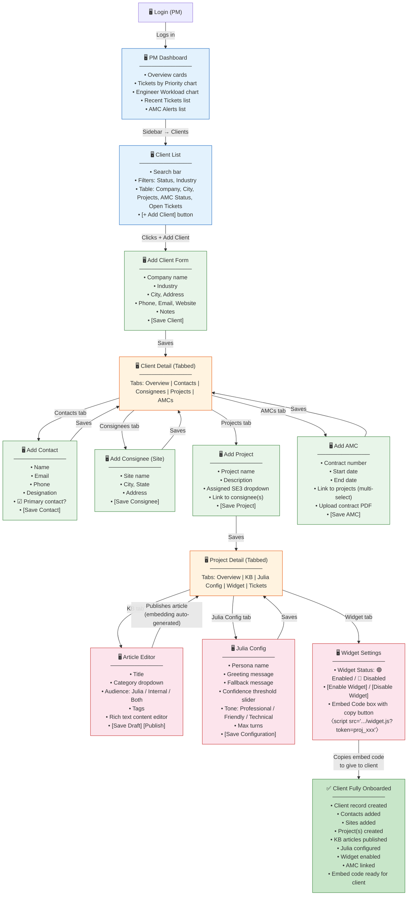

# Diagram 10: Wireflow — PM Sets Up a Client

> **Purpose:** Shows the PM the exact screen-by-screen flow for onboarding a new client into the system.
>
> **PM signs off on:** "This is how I set up a client. The steps are correct and complete."

---

## How to render

Copy each mermaid code block → paste into [mermaid.live](https://mermaid.live) → export as PNG/SVG.

---

## PM Client Setup Wireflow

---

## PM Setup Checklist (Minimum for Widget Go-Live)

```mermaid
graph LR
    S1["1️⃣ Create Client"] --> S2["2️⃣ Add Primary Contact"]
    S2 --> S3["3️⃣ Add Consignee"]
    S3 --> S4["4️⃣ Create Project<br/>(assign SE3)"]
    S4 --> S5["5️⃣ Write 5-10<br/>KB Articles"]
    S5 --> S6["6️⃣ Configure Julia<br/>(tone, threshold)"]
    S6 --> S7["7️⃣ Enable Widget<br/>(copy embed code)"]
    S7 --> S8["8️⃣ Link AMC"]
    S8 --> LIVE["🟢 Widget Live!"]

    style S1 fill:#bbdefb
    style S2 fill:#bbdefb
    style S3 fill:#bbdefb
    style S4 fill:#bbdefb
    style S5 fill:#ffe0b2
    style S6 fill:#ffe0b2
    style S7 fill:#c8e6c9
    style S8 fill:#c8e6c9
    style LIVE fill:#81c784,stroke:#2E7D32,color:#fff
```

---

## What This Diagram Tells the PM

1. **8-step onboarding process**: Client → Contact → Consignee → Project → KB → Julia Config → Widget → AMC
2. **PM does everything**: No other role can set up a client or enable a widget
3. **KB articles MUST exist before widget goes live**: Julia can't answer without content — minimum 5-10 articles
4. **Embed code is self-service**: PM copies a single script tag, gives it to the client's IT team
5. **AMC must be linked**: Otherwise widget blocks ticket creation on escalation
