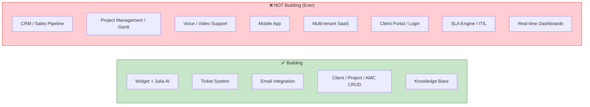

# Diagram 11: MVP Scope Map

> **Purpose:** Visual contract showing PM exactly what's in MVP, what's Phase 2, and what's Phase 3.
>
> **PM signs off on:** "This is the scope. I will not ask for Phase 2 features during MVP."

---

## How to render

Copy each mermaid code block → paste into [mermaid.live](https://mermaid.live) → export as PNG/SVG.

---

## MVP vs Phase 2 vs Phase 3

```mermaid
graph TB
    subgraph MVP["🟢 MVP — 12 Weeks (Must Ship)"]
        direction TB
        M1["✅ Auth<br/>Login, logout, JWT, password change"]
        M2["✅ User Management<br/>Create/edit/deactivate users, roles"]
        M3["✅ Client Management<br/>Full CRUD, contacts, consignees"]
        M4["✅ Project Management<br/>CRUD, SE3 assign, widget token"]
        M5["✅ AMC Management<br/>CRUD, project linking, status calc"]
        M6["✅ Knowledge Base<br/>Articles, audience tags, embeddings"]
        M7["✅ Julia Config<br/>Per-project: persona, tone, threshold"]
        M8["✅ Julia Pipeline<br/>FAQ (L1), RAG (L2), Escalate (L3)<br/><i>Single-turn only</i>"]
        M9["✅ Widget<br/>Chat, FAQ, escalation, AMC check"]
        M10["✅ Tickets<br/>Create, reply, note, escalate, resolve"]
        M11["✅ Email Out<br/>Ticket created, reply, escalation, resolution"]
        M12["✅ Email In<br/>Client reply parsing, thread matching"]
        M13["✅ Notifications<br/>In-app list, mark read"]
        M14["✅ File Upload<br/>Ticket attachments"]
        M15["✅ Basic Dashboards<br/>SE queue + PM overview cards"]
    end

    subgraph P2["🟡 Phase 2 — Weeks 13-20 (After MVP Validation)"]
        direction TB
        P2A["Multi-turn Julia conversations"]
        P2B["Julia Rulebooks"]
        P2C["Call logging on tickets"]
        P2D["Ticket merge"]
        P2E["Auto-nudge & auto-close"]
        P2F["Ticket reopen (by client)"]
        P2G["Client feedback collection"]
        P2H["KB search (global)"]
        P2I["Create KB article from ticket"]
        P2J["AMC expiry alerts (automated)"]
        P2K["All reports & dashboards"]
        P2L["Audit logs"]
        P2M["Canned responses"]
        P2N["Editable email templates"]
        P2O["Password reset via email"]
    end

    subgraph P3["🔴 Phase 3 — Weeks 21-26 (After 3+ Months Usage)"]
        direction TB
        P3A["Director dashboard"]
        P3B["Julia performance analytics"]
        P3C["Widget session analytics"]
        P3D["Engineer workload reports"]
        P3E["Layer resolution reports"]
        P3F["Client satisfaction scoring"]
        P3G["Email attachment extraction (inbound)"]
        P3H["Advanced Julia confidence tuning"]
        P3I["Bulk KB import"]
    end

    style MVP fill:#e8f5e9,stroke:#2E7D32
    style P2 fill:#fff9c4,stroke:#F9A825
    style P3 fill:#ffcdd2,stroke:#C62828
```

---

## Scope Boundary — One Diagram

---

## What This Diagram Tells the PM

1. **MVP is focused**: 15 feature groups. No reports, no analytics, no advanced Julia features
2. **Phase 2 adds polish**: Multi-turn Julia, merge, auto-nudge, reports — all "nice to have" that MVP works fine without
3. **Phase 3 needs data**: Analytics, scoring, advanced tuning — meaningless without months of real usage
4. **Hard "NOT building" boundary**: No CRM, no mobile app, no SaaS — these are scope traps
