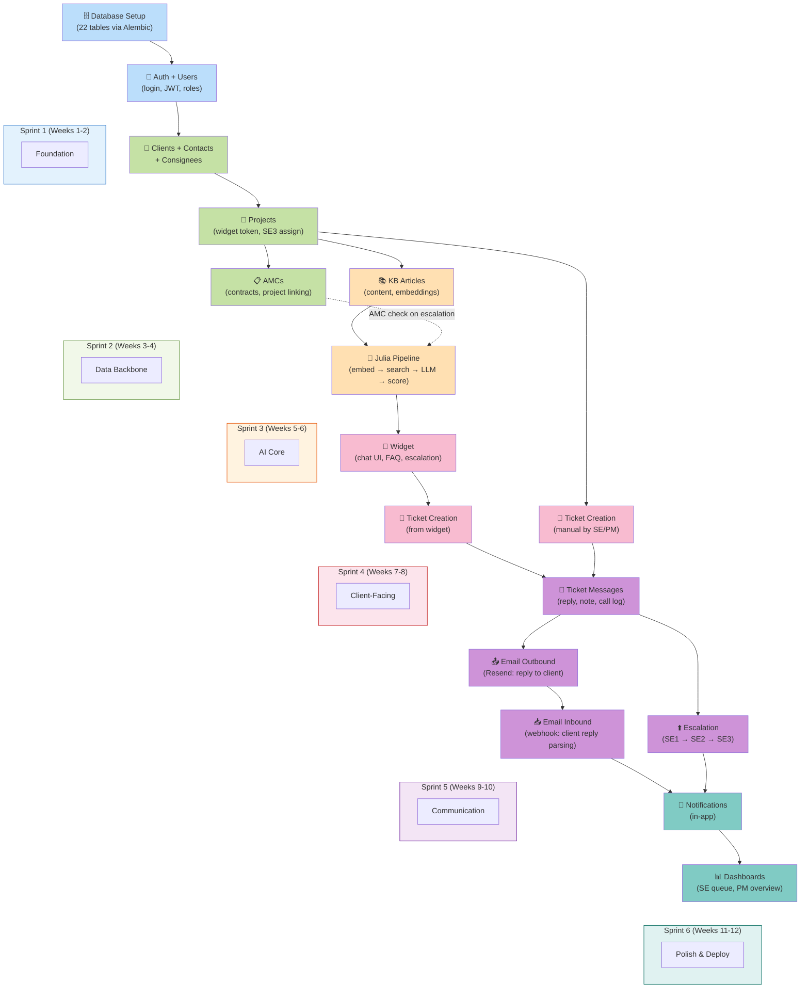

# Diagram 12: Sprint Dependency Map

> **Purpose:** Shows the PM why features must be built in a specific order — what blocks what.
>
> **PM signs off on:** "This build order makes sense. Dependencies are correct."

---

## How to render

Copy each mermaid code block → paste into [mermaid.live](https://mermaid.live) → export as PNG/SVG.

---

## Full Dependency Map

---

## Critical Path (What Delays Everything If Late)

```mermaid
graph LR
    CP1["DB + Auth"] -->|"blocks everything"| CP2["Projects"]
    CP2 -->|"blocks AI core"| CP3["KB + Embeddings"]
    CP3 -->|"blocks widget"| CP4["Julia Pipeline"]
    CP4 -->|"blocks client use"| CP5["Widget"]
    CP5 -->|"blocks support flow"| CP6["Tickets + Email"]

    style CP1 fill:#ffcdd2,stroke:#C62828
    style CP2 fill:#ffcdd2,stroke:#C62828
    style CP3 fill:#ffcdd2,stroke:#C62828
    style CP4 fill:#ffcdd2,stroke:#C62828
    style CP5 fill:#ffcdd2,stroke:#C62828
    style CP6 fill:#ffcdd2,stroke:#C62828
```

---

## What This Diagram Tells the PM

1. **Linear dependency chain**: You can't build Julia without KB. You can't build Widget without Julia. Everything chains
2. **Sprint assignments are logical**: Each sprint builds on the previous — no jumping ahead
3. **Critical path is DB → Projects → KB → Julia → Widget → Tickets**: Any delay in these delays everything
4. **AMC connects sideways**: It's not in the main chain but connects to Julia (escalation AMC check)
