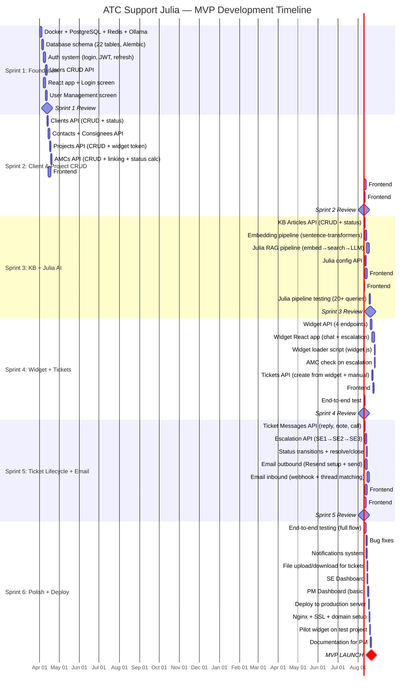
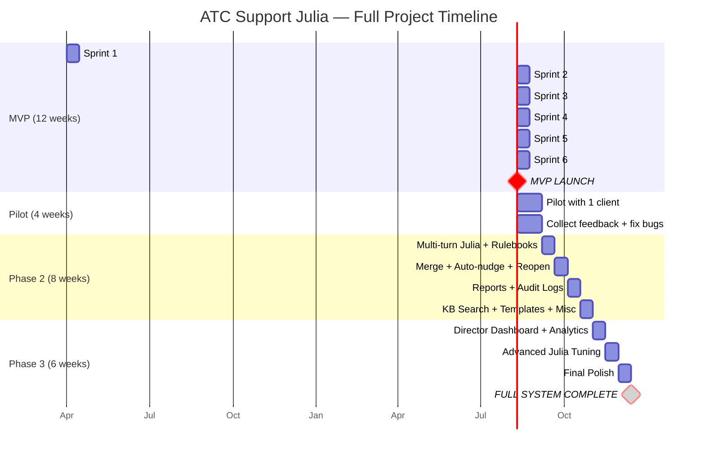

# Diagram 13: Sprint Timeline (Gantt Chart)

> **Purpose:** Shows the PM the 12-week MVP timeline with sprint breakdown and key milestones.
>
> **PM signs off on:** "This timeline is realistic. These milestones are correct."

---

## How to render

Copy each mermaid code block → paste into [mermaid.live](https://mermaid.live) → export as PNG/SVG.

---

## MVP Sprint Timeline (12 Weeks)

---

## Full Project Timeline (26 Weeks)

---

## Key Milestones

| Milestone | Week | What PM Sees |
|---|---|---|
| Sprint 1 Review | Week 2 | "Developer can log in, create users" |
| Sprint 2 Review | Week 4 | "PM can manage clients, projects, AMCs" |
| Sprint 3 Review | Week 6 | "Julia answers questions from KB" |
| Sprint 4 Review | Week 8 | "Widget works end-to-end" 🎯 |
| Sprint 5 Review | Week 10 | "Full ticket lifecycle with email" |
| **MVP Launch** | **Week 12** | **"System live with pilot client"** |
| Phase 2 Complete | Week 24 | "Reports, advanced features" |
| **Full System** | **Week 26** | **"Everything built"** |

---

## What This Diagram Tells the PM

1. **12 weeks to MVP, 26 weeks to full system** — clear, predictable timeline
2. **Bi-weekly milestones**: Every 2 weeks PM sees tangible progress — not vaporware
3. **Week 8 is the "wow" moment**: Widget works end-to-end for the first time
4. **4-week pilot buffer**: Between MVP and Phase 2 — time to collect real feedback
5. **Dates are movable**: The structure stays the same even if start date shifts
